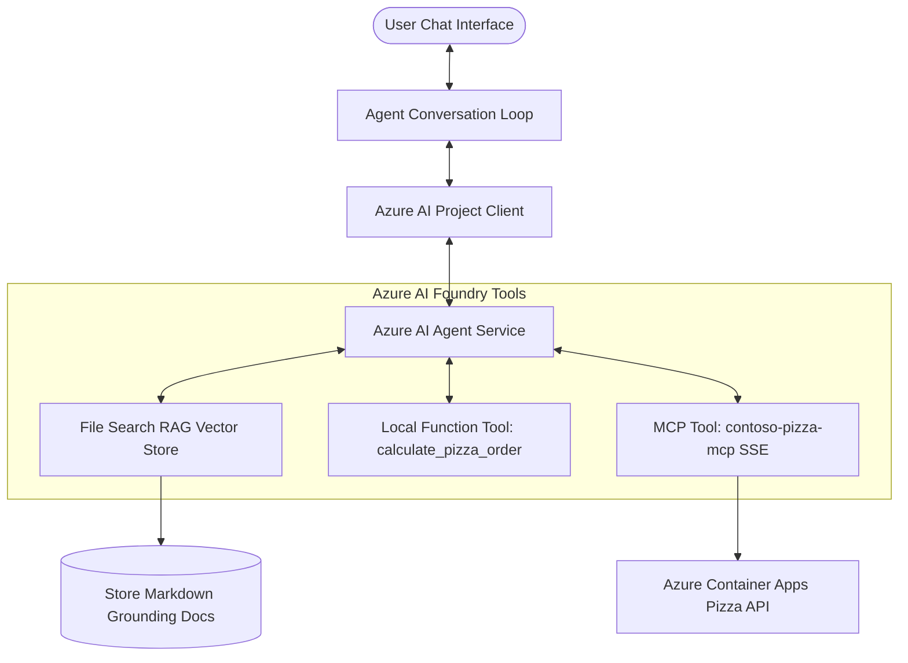

# Workshop Implementation Showcase: Contoso PizzaBot

Welcome! This documentation showcases my implementation journey building **Contoso PizzaBot**—an enterprise-grade, domain-specific AI assistant. 

I built this project during the Microsoft HQ OpenHack workshop, utilizing the **Microsoft Azure AI Foundry Agent Service** and the **Model Context Protocol (MCP)**. This site serves as a detailed portfolio of how I successfully bridged LLMs with real-world private data and external service systems, and includes instructions on how you can reproduce my setup.

---

## What I Built: Contoso PizzaBot 🍕🤖

The goal of my project was to create **Contoso PizzaBot**, a conversational agent that acts as a friendly, Gen Alpha-styled ordering assistant. Unlike a generic chatbot, PizzaBot is integrated into Contoso Pizza’s backend systems to answer store queries, recommend order sizes, and place real orders.

### Core Capabilities I Implemented:
1. **Dynamic Persona & Guardrails**: Configured with strict system rules to keep discussions focused on pizzas, handle Pineapple-on-pizza queries with playful snark, and require customer confirmation before checking out.
2. **Retrieval-Augmented Generation (RAG)**: Connected the agent to an Azure Vector Store containing localized markdown files for branches (Boston, Amsterdam, Sao Paulo, San Francisco, etc.) to query hours, addresses, and physical store menus.
3. **Deterministic Function Tools**: Configured the model to call local Python code to calculate pizza order quantities based on group sizes.
4. **Model Context Protocol (MCP)**: Integrated the agent over Server-Sent Events (SSE) to a live Container Apps service to query real-time toppings, place new orders, track status, or execute cancellations.

---

## My Key Learnings

Through this hands-on engineering experience, I mastered:
- **Azure AI Foundry SDK**: Initializing [`AIProjectClient`](https://github.com/evrankos/microsoft-pizza-agent-workshop/blob/main/agent.py#L12) and managing stateful assistants, threads, and runs.
- **RAG & Semantic Indexing**: Uploading and querying vector stores using [`FileSearchTool`](https://github.com/evrankos/microsoft-pizza-agent-workshop/blob/main/agent.py#L7) to inject domain-specific store details.
- **Strict Schema Tooling**: Exposing Python helper functions to the model with strict JSON validations using [`FunctionTool`](https://github.com/evrankos/microsoft-pizza-agent-workshop/blob/main/agent.py#L7) to handle exact math.
- **MCP Integration**: Leveraging [`MCPTool`](https://github.com/evrankos/microsoft-pizza-agent-workshop/blob/main/agent.py#L7) to dynamically inherit backend endpoints without custom API boilerplate.
- **Agent Loop Execution**: Intercepting tool run requests, executing local function calculations, and feeding results back into the response thread.

## Real-World Production Use Cases

To see how this combined architecture (RAG + Function Calling + MCP) scales to enterprise systems, check out the **Real-World Production Use Cases** detailed at the end of [Chapter 4: Tools & MCP Integration](./tool-calling-mcp.md#6-real-world-production-use-cases).

---

## Document Site Roadmap

**[1. Introduction & Overview](./introduction.md)** (This page)

**[2. Environment & Azure Setup](./setup-environment.md)**: How I authenticated, set up my Azure Resource Group, deployed models, and loaded configurations.

**[3. Building My First Agent](./building-agent.md)**: How I instantiated the project client, customized system instructions, and uploaded the store directory files for RAG.

**[4. Tools & MCP Integration](./tool-calling-mcp.md)**: How I registered local math function tools, integrated the SSE MCP backend ordering server, and handled the runtime loop.